# Accountless Authentication: A DNS-Based Architecture for Individualized Service Authorization

Author: ClearDNS, LLC · White paper · October 5, 2026 · contact@cleardns.io · DOI: [10.5281/zenodo.23128122](https://doi.org/10.5281/zenodo.23128122)

Online: [cleardns.com/research](https://cleardns.com/research/) · [github.com/cleardns/accountless-authentication](https://github.com/cleardns/accountless-authentication)

> **Personal identification is not a technical necessity.** A service can keep your settings, tell your devices apart, let several people share it with different permissions and charge for it, without asking for a name, an email address or an account password. We built a DNS service that works this way. The encrypted-DNS configuration installed on each device lets the service recognize that device and find its settings. Current permissions decide who may change them, and a PIN or MFA protects the dashboard in place of an email-and-password login. When a service like this asks who you are, that is a design choice. The technology did not require it.

## 1. Introduction

Many services ask for an email address before they do anything else. The address becomes the login name, the recovery channel and the key that joins a person to the records associated with the account. RFC 6973 describes how an identifier reused across contexts lets separate records be correlated and tied to a person [1], and data-minimization guidance says to collect information according to the function it serves. [2]

The jobs behind that form are usually narrow. A service has to find the right settings, recognize a returning participant, know who may change things and know what has been paid for. Each job needs a reliable way to recognize an authorized participant. These functions can be implemented without using a participant's name or email address as the basis of access.

An email-registered account adds three specific things to the risk model. A breach of account records together with device mappings ties retained activity to a reachable address, even when no activity row contains the email. Email-based recovery can make mailbox access a route to account takeover. Reused passwords can let credentials stolen from another service unlock the account. A service with no registration email, no mailbox reset and no email-and-password login has none of the three. It still holds other records, which Section 10 lists.

We built ClearDNS, a customized DNS filtering service, without an email address, a name or an account password. Enrollment installs an encrypted-DNS configuration on each device. The configuration carries a per-device credential, so every DNS request tells the resolver which policy, member and device it belongs to. The same authenticated request is how a dashboard login learns which policy it is for, and a PIN or MFA then decides whether the login may proceed. Invitations, roles, revocation and recovery codes do the remaining work an inbox usually does.

The approach is not specific to DNS filtering. Any service that can enroll a device and check its continued participation through an authenticated resolver could use it. ClearDNS is the working example examined here, and Section 13 gives procedures for checking what we describe.

## Contents

1. Introduction
2. What an account does, and how to do it without one
3. A working implementation and a conventional reference model
4. Policies, members and devices
5. Recognizing a device and attributing its requests
6. Credentials, current authority and filtering
7. Logging in to the dashboard
8. After login: sessions, roles and browsers
9. Enrollment, revocation and recovery
10. What the service records and who can see it
11. Credential handling and transport choices
12. Payment and entitlement
13. Testing the claims
14. Security assumptions and evidence
15. Conclusion
16. Invitation to independent technical review

## 2. What an account does, and how to do it without one

Apart from identifying you, an account does four things. It establishes who a new participant is. It lets a returning participant back in. It restores access when something is lost. It stops access when the relationship ends. Dropping the registration form is only useful if all four still work.

One established way to do this is an issued account number. The service generates a random number and the user enters it to establish access. That establishes access without requesting a name or an email address. The number serves as a user-held access credential.

In a DNS-backed design, the installed configuration supplies the enrolled device relationship automatically. When the device uses the service, the resolver authenticates the credential, finds the policy, member and device it belongs to, and checks that the device is still permitted. An application such as a management dashboard can then attach a pending login to that verified DNS use and apply its own security requirement and permissions. DNS says which enrolled relationship this is. The application decides what it may do.

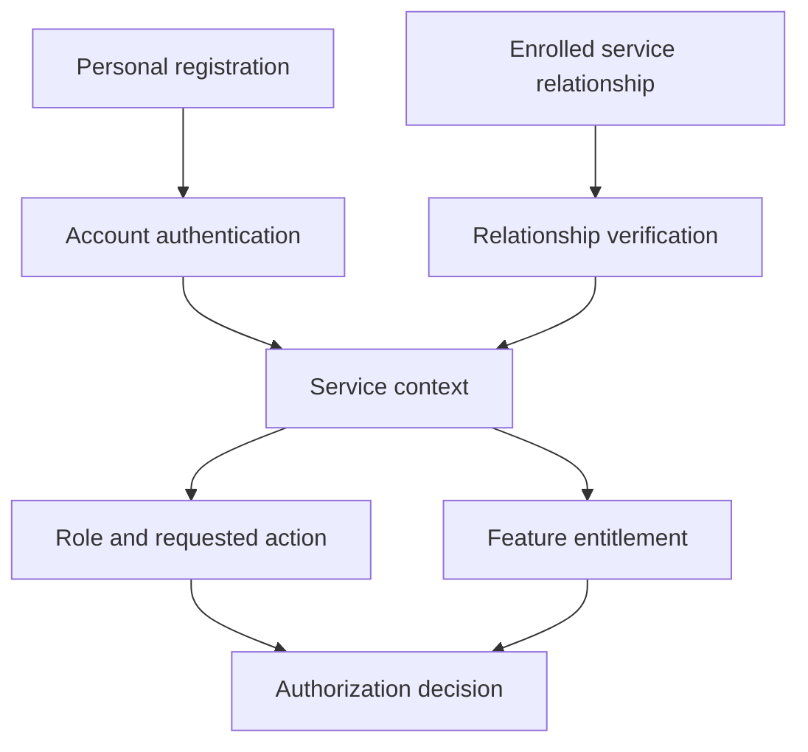
```mermaid
flowchart TD
  P["Personal registration"] --> A["Account authentication"]
  E["Enrolled service relationship"] --> V["Relationship verification"]
  A --> C["Service context"]
  V --> C
  C --> R["Role and requested action"]
  C --> F["Feature entitlement"]
  R --> D["Authorization decision"]
  F --> D
```

*Figure 1. Two routes to the same decision. Whichever foundation is used, access still ends in a permission check for the requested action.*

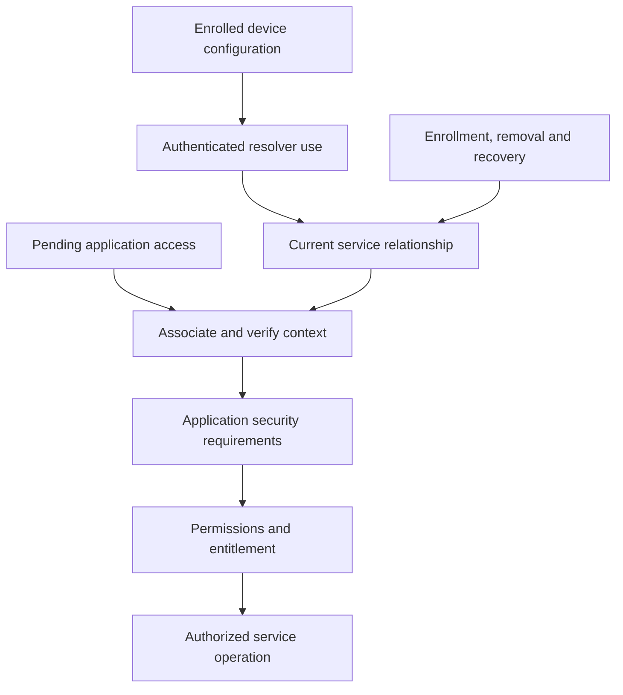
```mermaid
flowchart TD
  E["Enrolled device configuration"] --> R["Authenticated resolver use"]
  R --> B["Current service relationship"]
  Q["Pending application access"] --> V["Associate and verify context"]
  B --> V
  V --> S["Application security requirements"]
  S --> P["Permissions and entitlement"]
  P --> A["Authorized service operation"]
  L["Enrollment, removal and recovery"] --> B
```

*Figure 2. Authenticated resolver use associates pending application access with the enrolled relationship. Application checks then determine permitted access.*

These functions all refer to the same enrolled relationship. Removing a device stops its DNS use and fails its dashboard checks. Changing a role changes what that member may administer. Changing a subscription changes which features exist. None of these steps involves a name or an email address.

The design needs two parts: a resolver that authenticates its clients, and an application that can use what the resolver verified.

## 3. A working implementation and a conventional reference model

A customized DNS service is a demanding test of the idea, because a uniform public resolver would not do. Different policies keep different settings. Several people share a policy while holding different rights to manage it. Each device has to join the right policy under the right member, and each person should see only the activity they are allowed to see.

ClearDNS handles this with three records and one credential. A Policy holds the settings. A Member is a person's place in that policy. A Device is an enrolled service binding belonging to a member, associated with a configuration that carries its own Resolver Credential. The resolver authenticates the credential and checks that the device is still permitted. The dashboard starts from what the resolver verified and then applies the member's security requirement and role. [3-6]

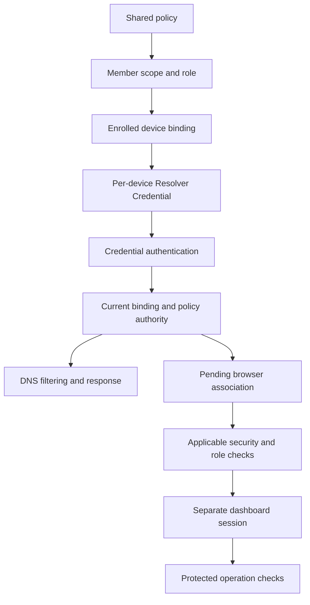
```mermaid
flowchart TD
  P["Shared policy"] --> U["Member scope and role"]
  U --> D["Enrolled device binding"]
  D --> C["Per-device Resolver Credential"]
  C --> A["Credential authentication"]
  A --> B["Current binding and policy authority"]
  B --> F["DNS filtering and response"]
  B --> R["Pending browser association"]
  R --> S["Applicable security and role checks"]
  S --> W["Separate dashboard session"]
  W --> O["Protected operation checks"]
```

*Figure 3. The ClearDNS path from policy to protected operation. DNS filtering branches off as soon as the binding is confirmed; dashboard access continues through further checks.*

For comparison, picture an illustrative conventional design. A personal account, opened with an email address and a password, owns one or more profiles. A profile holds the filtering settings. The DNS configuration on each device points at a profile, and an optional device label supports attribution. Logging in to manage settings and configuring a device to use them are separate acts with separate credentials.

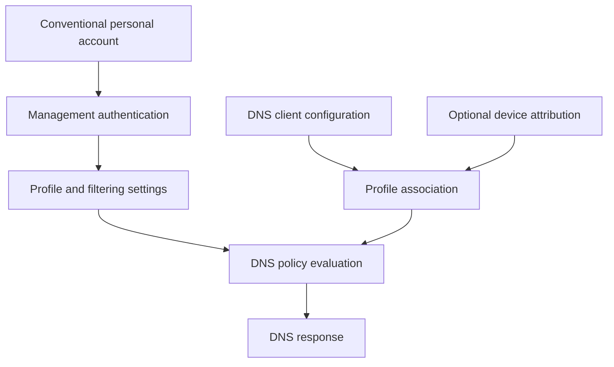
```mermaid
flowchart TD
  A["Conventional personal account"] --> M["Management authentication"]
  M --> P["Profile and filtering settings"]
  C["DNS client configuration"] --> X["Profile association"]
  L["Optional device attribution"] --> X
  P --> E["DNS policy evaluation"]
  X --> E
  E --> R["DNS response"]
```

*Figure 4. An illustrative conventional reference model. Management login and DNS configuration are separate entry points that meet only at the profile.*

The two designs differ in one place: how management access finds out which settings it is for. In the reference model, the user proves who they are to an account, and the account owns the profile. In ClearDNS, the device's authenticated DNS use identifies the policy, member and device, and the browser then earns its own, separately limited authority.

Profiles, roles, per-device credentials and temporary sessions can exist in either design. We do not claim them as differences. The comparison asks what establishes access, how it is verified and what a person must hand over to create it.

ClearDNS currently applies one filtering policy to every member and device in a policy. What differs per person is their role, their devices and the activity they may view. The member and device records could support per-person filtering; the product does not implement it.

## 4. Policies, members and devices

Each enrolled device receives its own Resolver Credential and belongs to exactly one member, who belongs to exactly one policy. [3, 6]

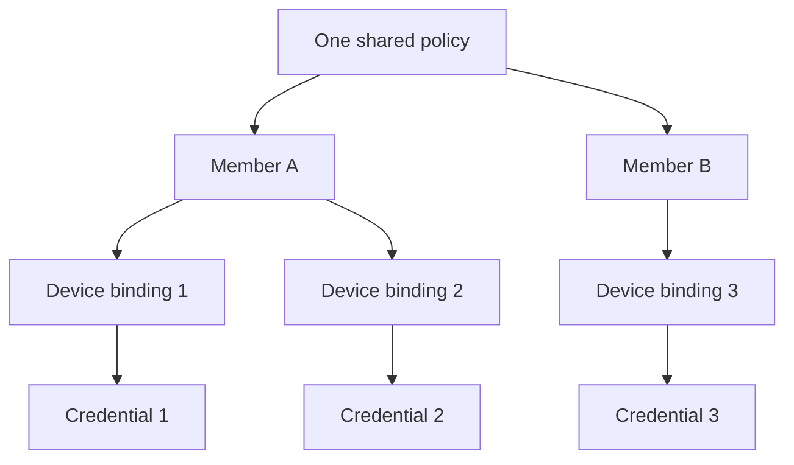
```mermaid
flowchart TD
  P["One shared policy"] --> U1["Member A"]
  P --> U2["Member B"]
  U1 --> D1["Device binding 1"]
  U1 --> D2["Device binding 2"]
  U2 --> D3["Device binding 3"]
  D1 --> C1["Credential 1"]
  D2 --> C2["Credential 2"]
  D3 --> C3["Credential 3"]
```

*Figure 5. One policy, two members, three enrolled bindings. Filtering is shared at the top; credentials are separate at the bottom.*

A device invitation adds an enrollment to an existing member, preserving that member's role and security settings. A member invitation creates a separate member, initially with MEMBER access. The OWNER can later change that member's role. The distinction determines whose permissions and activity scope apply to the new enrollment.

In the example above, all three devices use the same filtering settings. Because each has its own binding, one can be removed without touching the others, and activity can be attributed to the device that produced it. Because each belongs to a member, the service knows whose role applies.

Policy ID, Member ID and Device ID are names for these records. They locate a record and prove nothing. Only the Resolver Credential authenticates, so knowing an identifier is not the same as holding the credential or an authorized session.

The unit of authority is the enrollment, not the physical machine or its description. The same computer can be enrolled again as a separate device after its existing DNS configuration is removed and a new enrollment is completed. The two records may have identical names and model information but different bindings and credentials. Removing a local profile does not itself delete the earlier server-side binding. Opening another tab creates no device, while a supported browser enrollment can create another binding on the same machine.

## 5. Recognizing a device and attributing its requests

Two different questions are easy to confuse. What kind of device is this? And which enrolled device sent this request? The first is answered by recognition, the second by authentication.

Recognition is a convenience. ClearDNS runs its own self-hosted recognition engine with platform mappings and a device-model catalogue. It reads the signals a device makes available, produces a readable description and chooses the right provisioning path, including whether the device gets a DoH or a DoT configuration. Depending on the signals, the result is a specific model, a broader family, a raw model code or a generic label. [3]

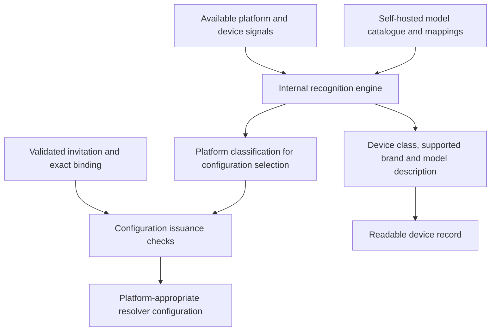
```mermaid
flowchart TD
  S["Available platform and device signals"] --> E["Internal recognition engine"]
  C["Self-hosted model catalogue and mappings"] --> E
  E --> M["Device class, supported brand and model description"]
  E --> P["Platform classification for configuration selection"]
  I["Validated invitation and exact binding"] --> G["Configuration issuance checks"]
  P --> G
  G --> R["Platform-appropriate resolver configuration"]
  M --> D["Readable device record"]
```

*Figure 6. Recognition describes the device and picks a configuration type. The validated invitation is what authorizes issuing the configuration.*

Attribution is a security function and uses none of that. The resolver trusts only the authenticated credential and the current state of its binding. A display name or a familiar model proves nothing, and a source IP address is not a substitute for the device credential. Two phones of the same model, enrolled separately, hold different credentials. An exact copy of a configuration represents the same enrolled binding.

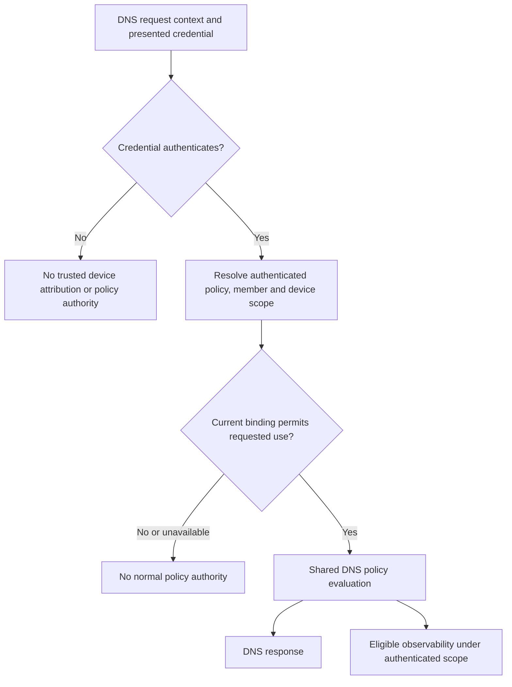
```mermaid
flowchart TD
  Q["DNS request context and presented credential"] --> A{"Credential authenticates?"}
  A -->|No| X["No trusted device attribution or policy authority"]
  A -->|Yes| I["Resolve authenticated policy, member and device scope"]
  I --> B{"Current binding permits requested use?"}
  B -->|No or unavailable| N["No normal policy authority"]
  B -->|Yes| F["Shared DNS policy evaluation"]
  F --> R["DNS response"]
  F --> O["Eligible observability under authenticated scope"]
```

*Figure 7. Two decisions in sequence. A request reaches policy evaluation only if it passes both.*

Recognition accuracy and credential validity can therefore be tested independently. A device description is not proof of authority. Access depends on the credential and the current binding.

## 6. Credentials, current authority and filtering

For every DNS request the resolver does four things in order. It authenticates the credential presented on the encrypted transport. It finds the policy, member and device the credential belongs to. It checks whether that device is still permitted to use the policy. Then it applies the policy's filtering rules and attributes any eligible activity to that member and device. [6]

**Resistance to credential guessing.** Knowing the Policy, Member and Device IDs is insufficient to reconstruct a usable Resolver Credential. The resolver cryptographically authenticates the credential in its exact provisioned form before granting policy authority. [6] After repeated distinct invalid credentials from a source address, the resolver and DoT gateways temporarily refuse requests unless the exact combination of credential and source address remains recognized in the handling instance's short-lived cache. Recognized requests remain subject to the normal authorization checks.

**A genuine credential can outlive the authority of its binding.** A removed device still holds a correctly formed configuration; nobody can reach into the device and erase it. The third step is what makes removal effective: the credential still authenticates, the binding no longer permits use, and the request gets no normal policy service. When the binding's state cannot be verified at all, the answer is also no.

Filtering itself combines explicit allow and block rules, curated category intelligence, SafeSearch where supported and answer protections. A request ends as a normal resolution, a block or a supported rewrite. [4]

Keeping filtering, resolver permission and dashboard permission apart has practical effects. A rule can change without reissuing any device's configuration. A member can gain or lose administrative rights without anything changing at the resolver. One device can be cut off while the rest of the policy carries on.

## 7. Logging in to the dashboard

There is no email-and-password form. A browser login starts as a pending attempt that belongs to no policy. The attempt is then associated with a DNS request arriving through an enrolled configuration, and the resolver's authentication of that request tells the dashboard which policy, member and device the attempt is for. The dashboard checks that the binding is current, looks up the member's security state and role, and only then issues a session. We call this Resolver-Verified Dashboard Access. [5]

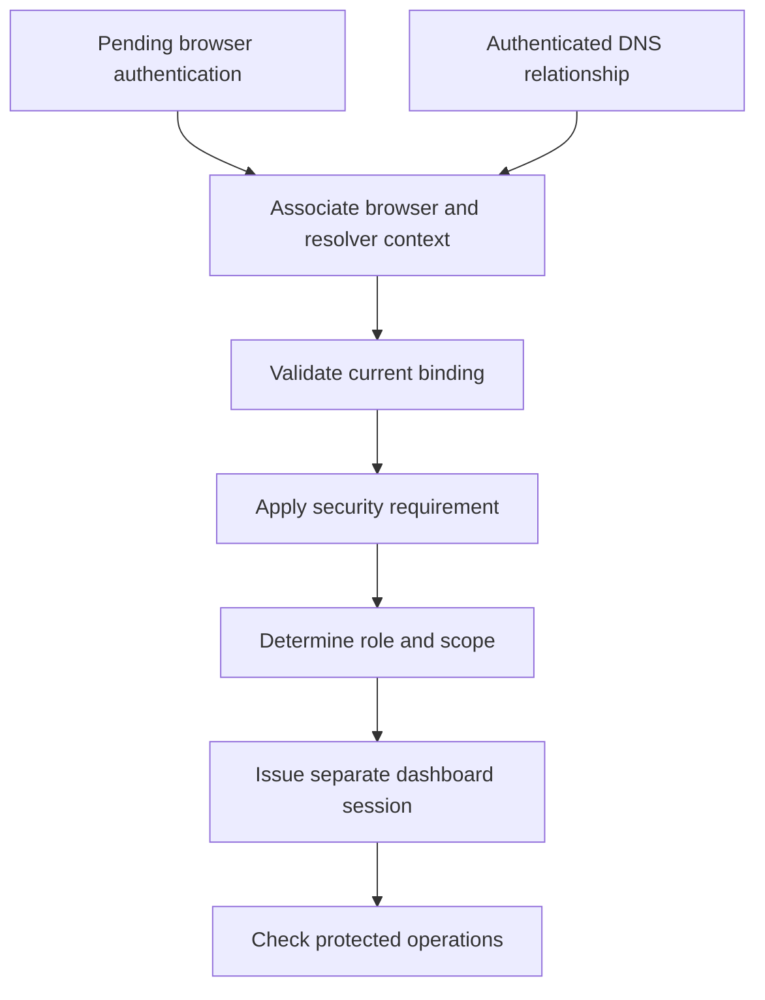
```mermaid
flowchart TD
  B["Pending browser authentication"] --> L["Associate browser and resolver context"]
  D["Authenticated DNS relationship"] --> L
  L --> V["Validate current binding"]
  V --> S["Apply security requirement"]
  S --> R["Determine role and scope"]
  R --> W["Issue separate dashboard session"]
  W --> A["Check protected operations"]
```

*Figure 8. A login from first request to session. The two inputs on the left must be associated before a dashboard session is issued.*

What the member must do next depends on their security state. An established member enters their Security PIN, or an authenticator code if MFA is enabled. Failed PIN entries trigger progressive cooldowns enforced for the member within the policy. MFA verification uses separate session-level backoff and cooldown controls. A browser the server has previously trusted can satisfy that requirement, but only when the server validates the trust against the member's current security state.

A member who has never set a PIN is treated differently. After resolver verification and binding validation they receive one initial session, which cannot be extended and carries normal authority for their role. Any later access requires a PIN: once the initial session has been used, the only thing available is a PIN-setup flow, which permits PIN setup rather than ordinary dashboard use. [5]

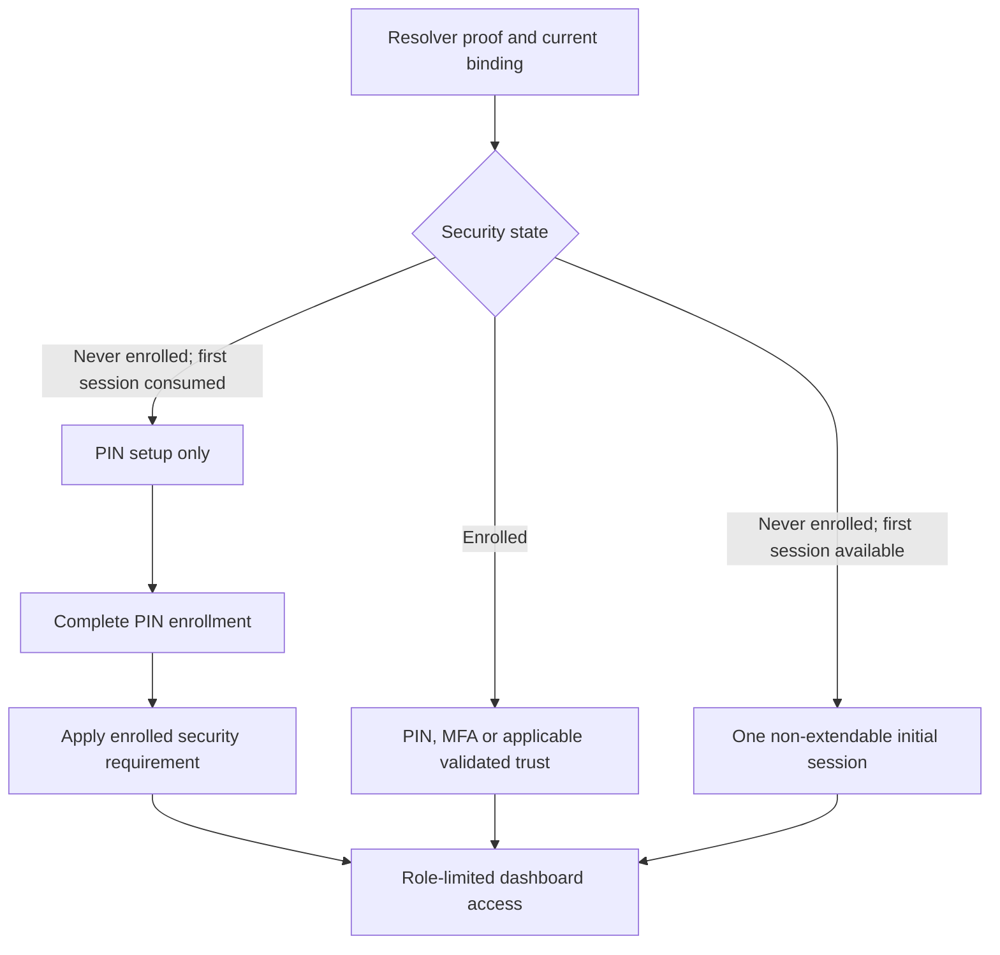
```mermaid
flowchart TD
  R["Resolver proof and current binding"] --> S{"Security state"}
  S -->|Enrolled| E["PIN, MFA or applicable validated trust"]
  S -->|Never enrolled; first session available| F["One non-extendable initial session"]
  S -->|Never enrolled; first session consumed| P["PIN setup only"]
  P --> N["Complete PIN enrollment"]
  N --> V["Apply enrolled security requirement"]
  V --> D["Role-limited dashboard access"]
  E --> D
  F --> D
```

*Figure 9. Three security states after resolver proof. Two lead to a session; the third leads to PIN setup first.*

The consequence for an attacker is concrete. A leaked email-and-password pair from another service has nowhere to be entered. A PIN on its own selects no policy. A resolver configuration on its own does not satisfy an established member's PIN or MFA requirement. [5, 6]

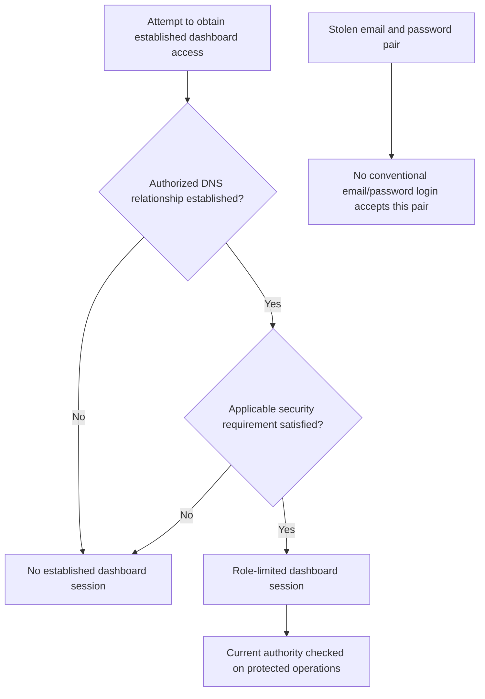
```mermaid
flowchart TD
  R["Attempt to obtain established dashboard access"] --> D{"Authorized DNS relationship established?"}
  D -->|No| N["No established dashboard session"]
  D -->|Yes| S{"Applicable security requirement satisfied?"}
  S -->|No| N
  S -->|Yes| W["Role-limited dashboard session"]
  W --> P["Current authority checked on protected operations"]
  E["Stolen email and password pair"] --> Z["No conventional email/password login accepts this pair"]
```

*Figure 10. Both questions must be answered yes. The stolen email-and-password pair has no login to be tried against.*

## 8. After login: sessions, roles and browsers

A session is a separate object from the Resolver Credential, with its own expiry and revocation. It carries the policy, member and device it is currently authenticated for. Every protected request checks that the session is valid and still the member's active session, that recent resolver-linked proof exists, that the binding is current, and that the member's role and the policy's entitlement allow the operation. [5]

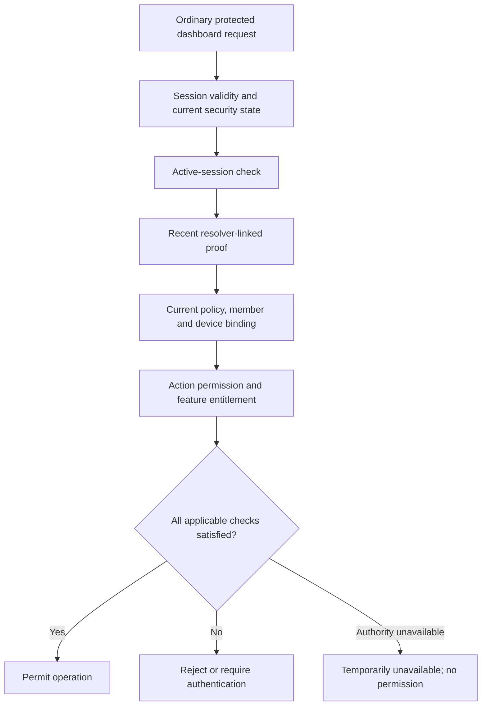
```mermaid
flowchart TD
  R["Ordinary protected dashboard request"] --> S["Session validity and current security state"]
  S --> V["Active-session check"]
  V --> PROOF["Recent resolver-linked proof"]
  PROOF --> B["Current policy, member and device binding"]
  B --> P["Action permission and feature entitlement"]
  P --> Q{"All applicable checks satisfied?"}
  Q -->|Yes| A["Permit operation"]
  Q -->|No| DENY["Reject or require authentication"]
  Q -->|Authority unavailable| U["Temporarily unavailable; no permission"]
```

*Figure 11. An ordinary protected request must satisfy these checks. The third outcome applies when authority cannot be verified.*

Dashboard access continues to depend on the enrolled DNS connection. While the dashboard is active, it checks for fresh signals and allows a short recovery period if they stop. If the connection is not restored, the dashboard ends the session and shows a logout page. Protected operations also check current session and binding authority on the server.

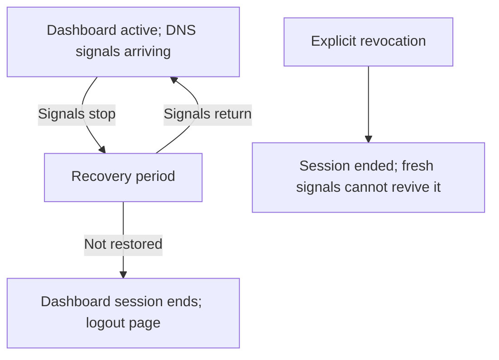
```mermaid
flowchart TD
  C["Dashboard active; DNS signals arriving"] -->|Signals stop| G["Recovery period"]
  G -->|Signals return| C
  G -->|Not restored| E["Dashboard session ends; logout page"]
  R["Explicit revocation"] --> X["Session ended; fresh signals cannot revive it"]
```

*Figure 12. While signals keep arriving the dashboard stays connected. An interruption starts a recovery period; an explicit revocation ends the session outright.*

A temporary interruption and an explicit revocation have different outcomes. Fresh signals can restore continuity during the recovery period; they cannot revive a revoked session.

In the foreground Safari tests, the warning and logout page appeared within tens of seconds; Section 13 reports the observations. A dashboard left idle for about five minutes is also signed out. These are implementation settings, not limits of the approach.

In our earlier test, Chrome on macOS continued using the enrolled DNS configuration for several minutes after the profile was removed, while a newly started browser could not authenticate. In a subsequent test using a fresh production profile and Chrome 154.0.8037.98, the dashboard authenticated without restarting Chrome. The browser's managed policies were manually reloaded before profile removal. Removal then led to automatic logout 28.0 seconds after Chrome's NetLog recorded a DNS configuration change following profile removal. Returning to the dashboard displayed "Not connected to ClearDNS." Chrome remained running throughout. The production profile generator now directs Chromium browsers through system DNS; existing Mac profiles must be replaced to receive these settings.

### Roles

Every policy has exactly one OWNER, who administers the policy, manages roles and handles payment. An ADMIN manages the policy and its participants but cannot touch billing or roles. A MEMBER sees their own eligible activity and can act on their own devices. A MEMBER can see the filtering options that apply but cannot change shared policy settings or administer other members. An explicit attempt to access another member's activity can also trigger session revocation, as observed in the tested activity endpoint. [3, 5, 7]

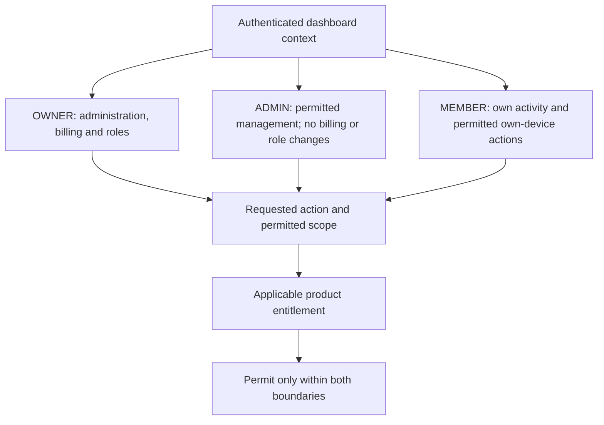
```mermaid
flowchart TD
  R["Authenticated dashboard context"] --> O["OWNER: administration, billing and roles"]
  R --> A["ADMIN: permitted management; no billing or role changes"]
  R --> M["MEMBER: own activity and permitted own-device actions"]
  O --> X["Requested action and permitted scope"]
  A --> X
  M --> X
  X --> E["Applicable product entitlement"]
  E --> Y["Permit only within both boundaries"]
```

*Figure 13. Role decides which actions are possible. Entitlement decides which features exist to act on.*

Role and subscription limit each other. A member allowed to view their activity still needs the policy to be on a tier that records it. A policy on that tier still does not let a MEMBER read another member's queries.

Two things are deliberately still possible after ordinary access has ended. When a policy has expired, its owner can still open the renewal page and pay, but cannot change settings or manage members until the policy is active again. And when a payment has already been approved, it is allowed to finish even if the dashboard session ends in the meantime, provided the payment itself is verified.

### Browsers and tabs

One independent dashboard login is active per member in a policy. Completing a login in another browser, or on another device, ends that member's older session. Another member's login is independent and ends nobody else's session. This affects the dashboard only; every enrolled device keeps resolving DNS.

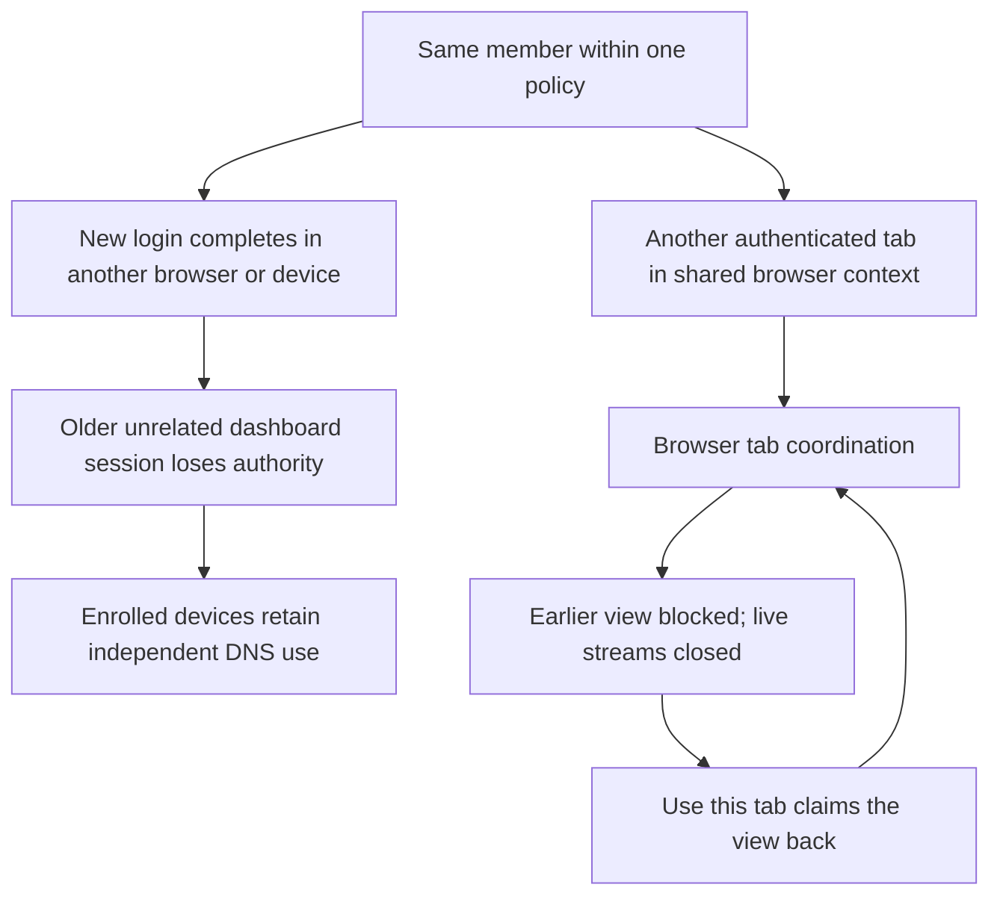
```mermaid
flowchart TD
  S["Same member within one policy"] --> N["New login completes in another browser or device"]
  N --> R["Older unrelated dashboard session loses authority"]
  S --> T["Another authenticated tab in shared browser context"]
  T --> C["Browser tab coordination"]
  C --> B["Earlier view blocked; live streams closed"]
  B --> U["Use this tab claims the view back"]
  U --> C
  R --> D["Enrolled devices retain independent DNS use"]
```

*Figure 14. A new login by the same member replaces that member's older session. Separately, tabs in one browser pass the active view back and forth.*

Tabs in the same browser cooperate. When a second tab authenticates, the first is blocked and its live streams close, and “Use this tab” takes the view back. This is a courtesy between tabs built on shared browser state. The server's session checks still decide every protected request. A private window or a separate browser profile counts as a different browser.

## 9. Enrollment, revocation and recovery

### Joining

An invitation is a single-use capability created on the server, with an acceptance deadline, delivered as a QR code or a link. Its purpose is fixed when it is created: add a device to an existing member, or create a new member with initial MEMBER access. The OWNER manages subsequent role changes separately. [3]

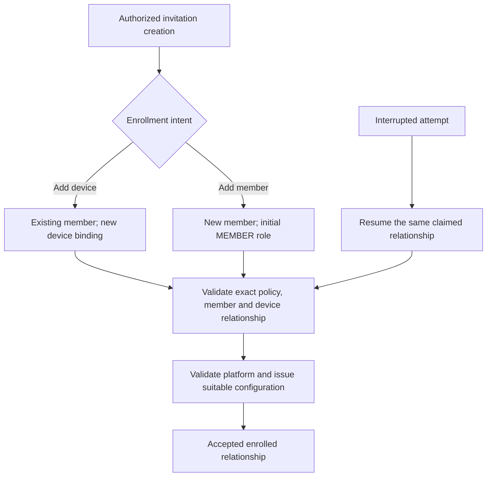
```mermaid
flowchart TD
  I["Authorized invitation creation"] --> K{"Enrollment intent"}
  K -->|Add device| D["Existing member; new device binding"]
  K -->|Add member| U["New member; initial MEMBER role"]
  D --> B["Validate exact policy, member and device relationship"]
  U --> B
  B --> P["Validate platform and issue suitable configuration"]
  P --> A["Accepted enrolled relationship"]
  T["Interrupted attempt"] --> R["Resume the same claimed relationship"]
  R --> B
```

*Figure 15. Two kinds of invitation converge on one validation step. A retried attempt rejoins the same path.*

Accepting the invitation creates the binding and issues a configuration suited to the platform. If the attempt is interrupted, retrying resumes the same binding and does not create a second participant. A MEMBER can add a device for themselves when the plan has capacity. Adding a member requires administrative rights.

The macOS installation profile includes managed DNS preferences for supported browsers. When configured, it also includes the ClearDNS root certificate for optional HTTPS block pages, allowing a blocked site to display an explanation instead of a generic browser error. For manual installation on macOS 13 or later, the user separately enables TLS trust. That trust allows applications that honor it to accept server certificates chaining to the root. The certificate supports block-page delivery; it is not required to authenticate enrolled devices or dashboard users.

### Removing

A configuration file can be copied, and the resolver cannot tell a copy from the original. So the service does not try to find copies. Removing the binding on the server withdraws authority from the original and from every copy, and a newly enrolled device gets a new binding and a new credential. Removing the profile from a device does not remove its binding. [6]

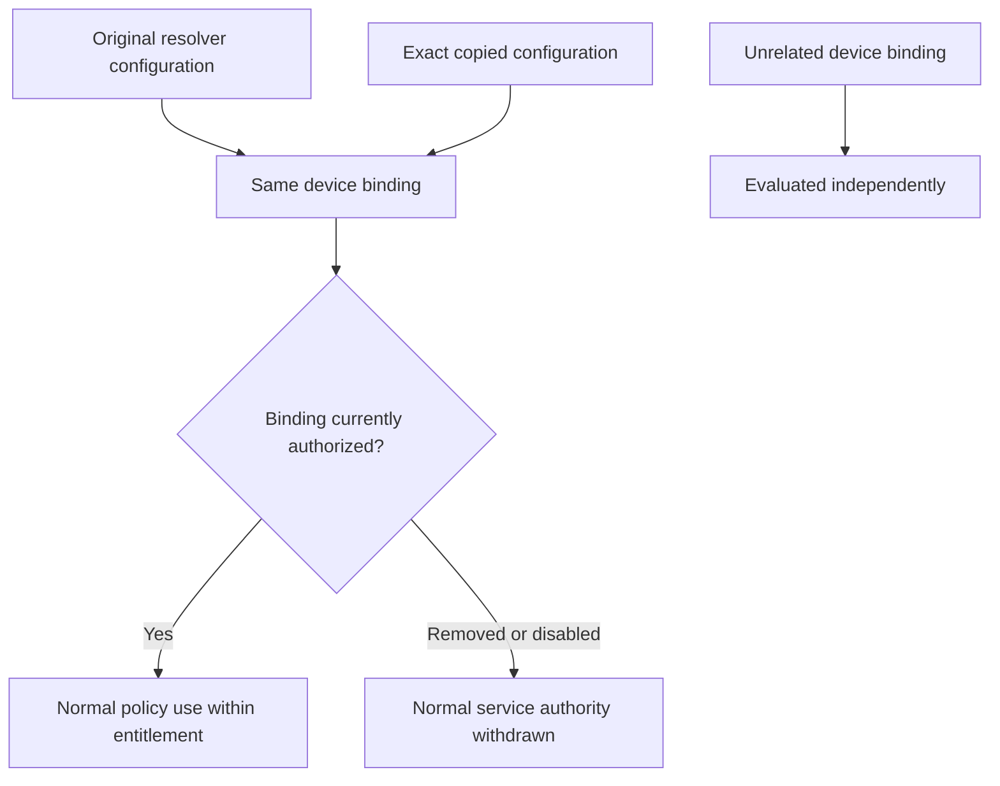
```mermaid
flowchart TD
  O["Original resolver configuration"] --> B["Same device binding"]
  C["Exact copied configuration"] --> B
  B --> V{"Binding currently authorized?"}
  V -->|Yes| A["Normal policy use within entitlement"]
  V -->|Removed or disabled| N["Normal service authority withdrawn"]
  U["Unrelated device binding"] --> S["Evaluated independently"]
```

*Figure 16. The original and an exact copy rely on the same binding. Removing that binding withdraws authority from both; the time at which each client first observes refusal is measured separately.*

Ending a dashboard session and removing a device are different actions. The first ends one browser's access. The second ends the device's DNS use and fails any dashboard check that depends on its binding.

### Getting back in

Losing one device need not require Policy Recovery. If the owner can still authenticate to the dashboard from another enrolled device, they can remove the lost device's binding and enroll a replacement. The remaining devices retain their own bindings, and the policy continues with its existing settings and entitlement.

Policy Recovery takes three things: the Policy ID, the Policy Recovery Code the owner was given, and the owner's current PIN or MFA factor. It allows a new device to be enrolled into the existing policy. It is not a dashboard session; logging in afterwards works as described in Section 7. [8]

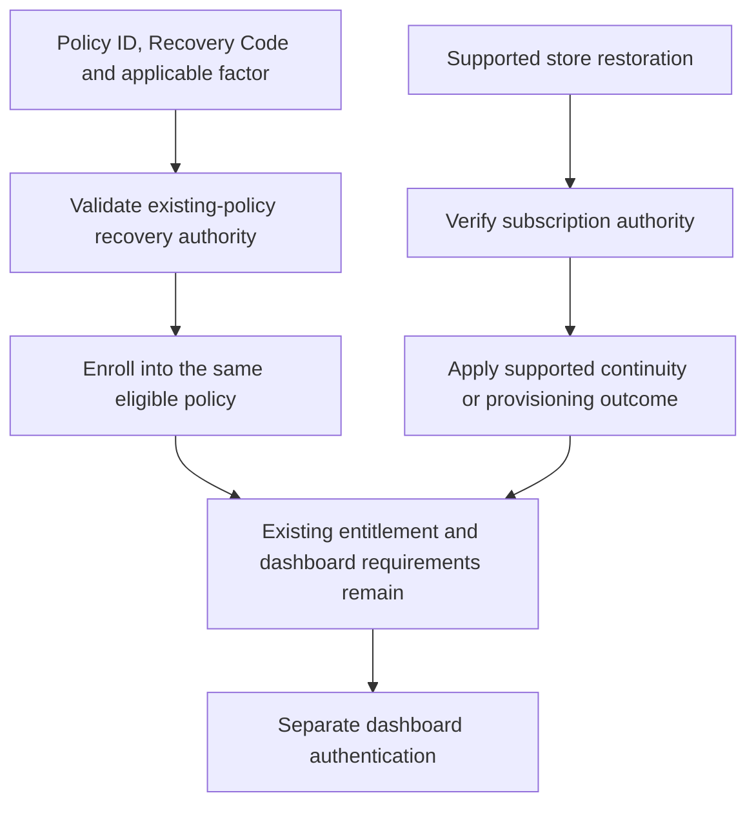
```mermaid
flowchart TD
  P["Policy ID, Recovery Code and applicable factor"] --> V["Validate existing-policy recovery authority"]
  V --> E["Enroll into the same eligible policy"]
  E --> S["Existing entitlement and dashboard requirements remain"]
  R["Supported store restoration"] --> T["Verify subscription authority"]
  T --> C["Apply supported continuity or provisioning outcome"]
  C --> S
  S --> D["Separate dashboard authentication"]
```

*Figure 17. Two ways back in: recovery material held by the owner, or a subscription verified with the store.*

Policies in TRIAL, ACTIVE, GRACE or EXPIRED state can be recovered. Provisional and destroyed policies cannot. Recovery keeps the existing entitlement and the original trial dates. It does not restart a trial or create a paid plan.

Smaller losses have their own remedies. A PIN Recovery Code resets a forgotten PIN. An MFA Backup Code stands in for a lost authenticator and switches MFA off so that it can be set up again. Store restoration re-verifies a subscription with the app store.

Recovery material has different handling according to its purpose. An authorized OWNER can view the current Policy Recovery Code again through the protected dashboard. PIN Recovery Codes are shown when generated and cannot later be retrieved from the server. MFA Backup Codes provide a separate emergency authentication path. There is no support-side master PIN or email reset. If no supported recovery route remains available, the service cannot reconstruct access from billing details alone. [8]

## 10. What the service records and who can see it

Two questions decide what anyone can see. Was the activity recorded? Is this viewer allowed to see it? The policy's tier answers the first and the member's role answers the second. A subscription can turn on history for the whole policy while a MEMBER still cannot read another member's queries.

Four data flows matter for this discussion. The public documentation also describes security records, de-identified service intelligence and aggregate measurement. [7, 9]

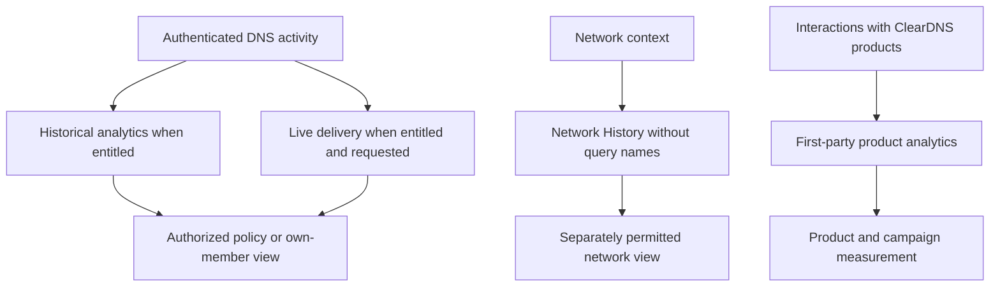
```mermaid
flowchart TD
  D["Authenticated DNS activity"] --> H["Historical analytics when entitled"]
  D --> L["Live delivery when entitled and requested"]
  N["Network context"] --> W["Network History without query names"]
  P["Interactions with ClearDNS products"] --> A["First-party product analytics"]
  H --> R["Authorized policy or own-member view"]
  L --> R
  W --> S["Separately permitted network view"]
  A --> M["Product and campaign measurement"]
```

*Figure 18. Four data flows from three sources. Of these four, only historical analytics and live delivery carry DNS query names.*

Historical Analyze stores query history, for no more than 90 days, on the ANALYZE and FULL tiers. ESSENTIAL and STREAM create no policy-linked query history. Network History records when a device's network address changes and never contains query names. De-identified service intelligence keeps DNS observations with the policy, member and device identifiers and the client IP address removed.

Live query delivery uses a transient per-policy buffer at the edge, activated by authorized dashboard use. Events expire from this buffer within one minute of receipt, and the buffer creates no persistent query-history database. A brief continuation window supports reconnection. On STREAM, FULL and the trial, which has FULL features, this path delivers the queries themselves as Instant Logs and the Live Traffic Map. On ANALYZE and ESSENTIAL, which do not include live viewing, it runs in a count-only mode: the dashboard displays a running query count as a prompt to upgrade. That count carries no query names and creates no individual query log.

Choosing ESSENTIAL during a trial stops collection and removes the trial's logs from the dashboard. Upgrading later starts collection again from that point; the earlier trial and ESSENTIAL-period activity stays inaccessible and old live buffers are not replayed. Three things should not be confused: hiding a view, stopping collection and deleting what was already stored. Anything already viewed or exported stays with whoever has it.

### What a breach would and would not expose

Where a DNS service retains query history linked to an email-registered account, the account mapping can connect that history to the registration address, even when individual query records contain no email. A breach exposing both datasets can reveal that association without requiring the attacker to recover an account password. ClearDNS links eligible DNS activity to Policy, Member and Device records, but enrollment adds no name or email address to that chain.

Other records remain. The resolver necessarily receives the connecting IP address and the names a device looks up. Purchases produce transaction evidence, and the store or payment provider knows the buyer. Our first-party product analytics is kept indefinitely and can link visits across the website, dashboard and apps through pseudonymous identifiers; it is a separate dataset and receives no DNS queries. [9] A participant could still be identified by these other means. What our registration records cannot expose is an email address, a name or an account password, because enrollment collects none.

## 11. Credential handling and transport choices

Different actions need different secrets. A resolver configuration lets a device use the policy. An invitation or a recovery code authorizes one lifecycle step. A PIN or MFA factor protects administration. A session lets one browser act for a while. Identifiers grant nothing. Resolver credentials and configuration capabilities are kept out of ordinary logs, analytics events and unnecessary URLs, and copies kept by our apps use the applicable secure storage. [3, 5, 6, 8, 9]

We use DoH and DoT because they combine encryption with configuration that mainstream platforms support natively; Apple's DNS settings payload, for example, accepts both. The per-device credential sits in the HTTPS path for DoH and in the resolver hostname for DoT. [10-12]

A setup that selects a policy through a shared source IP address cannot distinguish the devices behind that address; a per-device credential can. Nothing limits the design to DoH and DoT. DNS over QUIC is an encrypted DNS transport and DoH can run over HTTP/3; either would need the same credential and binding checks. [13, 14]

### Who can see the credential

Where the credential sits decides who can see it. In an HTTPS path it is inside TLS: we receive it, and routers and ISPs on the way cannot read it. In a resolver hostname it is exposed in two separate places. The resolver the device uses to look up that hostname receives the name. And an observer on the network may see the name in the connection's metadata, unless Encrypted Client Hello hides it there. ECH does nothing about the first path. [10, 15]

So an encrypted query is not the same as a hidden endpoint name, and a pseudonymous credential that is visible in metadata is still linkable. [16] In this implementation, a complete resolver hostname with its exact letter case contains enough credential material to reproduce DNS access under the same binding, for as long as that binding and its policy permit use. When a collected resolver hostname is converted to lowercase, the resulting record can lose information required for authentication. ClearDNS validates the credential's exact provisioned capitalization: a lowercased copy that changes that capitalization is rejected by the resolver. Such a record is therefore not directly reusable for DNS access, although it still reveals the underlying letters. Removing the binding withdraws copied access; it does not undo the original exposure. For established members, dashboard access additionally requires satisfaction of the separate PIN or MFA security requirement, as described in Sections 7 and 14.

Looking a name up on the wider internet is a separate exchange. We leave our Policy, Member and Device identifiers and the Resolver Credential out of it. The upstream resolver still sees the question, its timing and our egress address. Passing a client subnet upstream is off unless a policy turns it on, and fallback, latency hedging or sampled comparison can send one question to more than one upstream. [9]

## 12. Payment and entitlement

Paying for a feature, being allowed to use it and being allowed to administer it are three decisions made from three kinds of evidence. A subscription can enable history for a policy without making the payer's identity a login, and without giving an ADMIN the right to change the plan. [9]

App stores and payment processors carry out the purchase and send transaction evidence. We verify that evidence ourselves, in a subscription layer we built and host, and set the policy's entitlement from it.

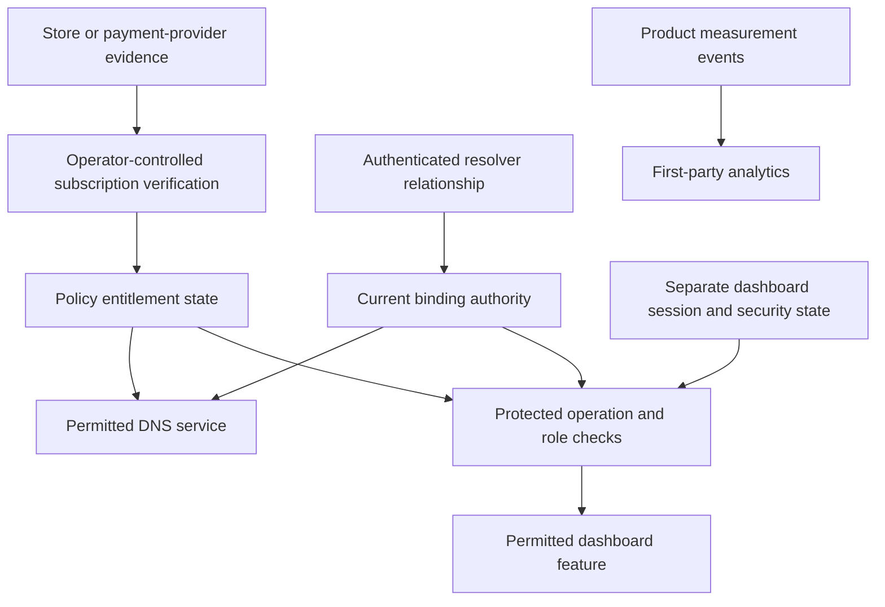
```mermaid
flowchart TD
  E["Store or payment-provider evidence"] --> V["Operator-controlled subscription verification"]
  V --> T["Policy entitlement state"]
  C["Authenticated resolver relationship"] --> B["Current binding authority"]
  T --> N["Permitted DNS service"]
  B --> N
  S["Separate dashboard session and security state"] --> G["Protected operation and role checks"]
  B --> G
  T --> G
  G --> D["Permitted dashboard feature"]
  M["Product measurement events"] --> A["First-party analytics"]
```

*Figure 19. Payment verification supplies entitlement; resolver and session checks supply access authority. Product measurement supplies neither.*

An activation still waiting for the store's confirmation is a different state from a confirmed one. Product measurement events, which tell us how the website and apps are used, are never accepted as proof of payment or ownership. Keeping marketing measurement out of access decisions is deliberate.

## 13. Testing the claims

The following procedures examine enrollment, shared filtering, permissions, session behavior, recovery and changes in logging entitlement through the running service. They need one eligible multi-member policy, a second policy with different settings, a few devices you own and one participant in each role.

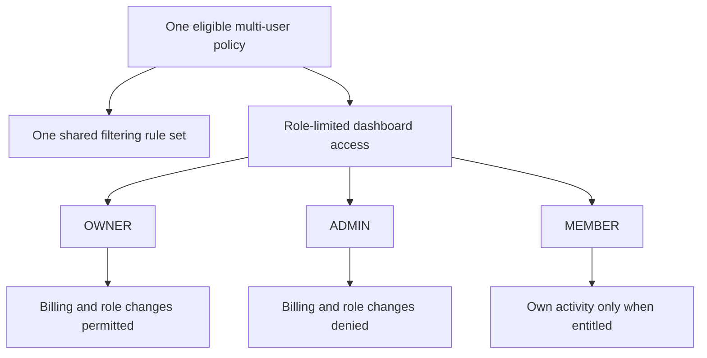
```mermaid
flowchart TD
  P["One eligible multi-user policy"] --> F["One shared filtering rule set"]
  P --> R["Role-limited dashboard access"]
  R --> O["OWNER"]
  R --> A["ADMIN"]
  R --> M["MEMBER"]
  O --> B["Billing and role changes permitted"]
  A --> N["Billing and role changes denied"]
  M --> S["Own activity only when entitled"]
```

*Figure 20. The test setup: one policy, one shared rule set, three roles with different limits.*

Each procedure states a claim, what to do, what should happen and what to write down. Our own observations from running them follow the procedures.

### Enrollment and recognition

:::test
Claim: Enrollment keeps the intended member and creates the right device binding.
Action: Add a second device for an existing member, invite a new member and interrupt an acceptance, then retry it. Enroll two devices of the same model separately.
Expected: Separate bindings, each under the right member and role, with a suitable configuration and a device description that reflects the available signals. The retry resumes the same binding.
Evidence: The policy, member and device each binding ends up under, using neutral aliases.

### Shared filtering

:::test
Claim: Filtering settings are shared within a policy and independent between policies.
Action: Change a rule for a test domain and query it from every device once caches have expired. Query it through the second policy.
Expected: The rule applies to every device in the first policy. The second policy keeps its own settings.
Evidence: The response on each device and policy.

### Roles

:::test
Claim: What a participant can do is limited by role and by entitlement.
Action: In each role, try to change settings, manage participants, open billing, change roles and view activity, including by calling the protected endpoints directly.
Expected: OWNER: administration, billing and role management permitted, subject to the policy tier, the policy state and each operation's own requirements. ADMIN: policy and participant management and the policy-wide activity views the tier provides; billing and role changes refused. MEMBER: own eligible activity and own-device actions; shared administration, billing, role changes and other members' activity refused.
Evidence: The server's decision for each role and operation, and the tier in effect.

### Credentials and revocation

:::test
Claim: A credential must be both authentic and currently authorized.
Action: Query with the issued configuration, with a slightly altered credential and with an exact copy. Remove the binding, then keep querying from the original and the copy and keep calling the dashboard.
Expected: The altered credential is rejected. After removal is enforced, neither the original nor an exact copy receives normal service under that binding. Unrelated bindings retain their own authority.
Evidence: Which binding each accepted request was attributed to, and the first refused request from each client, recorded separately. A refused client may receive a block-page answer instead of an error.

### Dashboard login and sessions

:::test
Claim: Login needs the verified resolver relationship and the applicable security requirement, and a newer login replaces an older one.
Action: Attempt login without an enrolled resolver, then with one but without satisfying the security requirement. Exercise the initial session, the used-up first-use state, a freshly entered PIN or MFA code and a previously trusted browser. Log in from a second browser and then a second device, and use the older session each time. Test tab hand-over separately.
Expected: No established session without both. A trusted browser passes only when the server validates the trust against current security state. First-use states follow their rules. The older session is refused once the newer login completes.
Evidence: Server decisions and timing, recorded separately for fresh PIN or MFA entry and for trusted-browser continuation.

### One login, one proof

:::test
Claim: Resolver proof attaches only to the pending login it belongs to.
Action: With devices you own, hold two pending logins open at once: one in a browser on an enrolled device, one in a browser on a device enrolled under a different member or policy. Complete resolver verification for one only. Repeat with the second login started on a device that has no enrolled configuration.
Expected: Each login receives only the context of the device whose verification it actually received. A login with no verification of its own stays pending and gets no session.
Evidence: For each login, the policy, member and device the server attached and the login's final state.

### Recovery and tier changes

:::test
Claim: Recovery keeps the policy intact, and a paid tier replaces trial-only logging.
Action: Recover an eligible policy, including one in trial. Separately, move a trial to ESSENTIAL and later to a logging tier, generating recognizable traffic before and after each change.
Expected: The recovered policy keeps its entitlement and trial dates. Collection stops when it should, and earlier activity stays inaccessible after the upgrade.
Evidence: Entitlement and trial dates before and after. Collection, reads, exports and live buffers, each checked on its own.

For every run, record the service version if available, the date, platform, browser, transport, policy state, role and tier, the expected result and the actual one. Include failures and unclear results. Remove credentials, recovery material, session values and personal network details before publishing.

### What we observed

ClearDNS is a live service that continues to change. These selected functional observations describe the service as we tested it; later versions may behave or perform differently. We ran the procedures against the live service, with the operator assisting. Most devices were separate resolver configurations and browser profiles on one Mac, sharing a network address; one enrollment used an iPhone. Payments used test mode, and some participants were prepared through privileged fixture setup. The figures below describe that run. They are not guarantees across locations or load.

**Enrollment.** A device invitation accepted on an iPhone added a binding under the existing member. A member invitation created a separate member with MEMBER access, and reopening that invitation after setup created nothing further.

**Shared filtering.** A rule changed through the dashboard reached every tested configuration in the policy, while a second policy kept its own settings. The first changed responses arrived 0.0 to 6.3 seconds after the dashboard acknowledged the change. Polling was sequential, so the timing resolution was roughly half a second to three seconds.

**Roles.** The sampled endpoints enforced the role model. OWNER and ADMIN could change filtering and view policy-wide activity; a MEMBER could not change filtering and saw only its own activity. Billing reads and role management were limited to the OWNER. A MEMBER request for another member's activity ended that session.

**Credentials and removal.** A credential altered by one character was refused on both DoH and DoT. After a binding was removed, the original client and a dashboard session tied to it were first refused at about 0.6 seconds in each of three runs. An exact copy of the configuration was first refused between 0.6 and 2.8 seconds. Refusal here means the client stops receiving normal policy service; it may receive a block-page answer instead of an error. Another device in the policy kept resolving throughout.

**Login and sessions.** A browser with no enrolled resolver obtained no session. Wrong PINs were refused. A member with no PIN who had used the initial session reached PIN setup only. A trusted browser logged in without a PIN step, and with its trust altered the server asked for the PIN. In six runs a newer login by the same member ended the older session, whose first refusal was recorded within approximately 0.63 seconds before or after receipt of the newer login response. Another member's session was unaffected.

**Loss of the DNS signal.** In three foreground Safari runs, the operator reported the logout page approximately 30 to 52 seconds after removing the device's DNS profile. Warnings were reported after approximately 14 to 16 seconds in the two cases where warning timing was recorded. Reinstalling the profile during the warning allowed the session to continue. A freshly started browser without the configuration obtained no session.

**MFA.** With MFA enabled, login asked for the authenticator code instead of the PIN. Wrong codes were refused. A correct code gave a usable dashboard in 4.3 to 4.5 seconds. A backup code was accepted once.

**One login, one proof.** With three logins pending at once on one host and network, resolver proof attached only to the login that produced it. A configured browser whose probes were held back and a browser with no configuration both stayed pending for the 60 seconds observed.

**Recovery and logging.** Policy Recovery on a policy in trial added a new owner device and left the entitlement and trial dates unchanged. After trial logging was switched off by selecting ESSENTIAL and re-enabled with FULL, history and an export contained the new marker query and not the earlier trial marker. In a further run, marker queries sent during an ESSENTIAL period appeared in no history, export or live view after the upgrade, and a direct check of the analytics store found no record of them.

**Transport visibility.** A capture summary from one DoT client recorded that the complete credential-bearing resolver hostname appeared with its exact letter case in both a plaintext lookup and the TLS handshake. The client did not offer ECH. This result concerns that client and network path.

## 14. Security assumptions and evidence

### What each secret is worth to an attacker

A copied resolver configuration gives DNS use under that binding until the binding is removed. It does not give an established member's dashboard, which still needs the PIN or MFA factor. A PIN by itself gives nothing, because it selects no policy. A configuration and the matching factor together give that member's dashboard privileges. Stolen session material may permit actions within that session's role while the server's continuing proof and authorization checks remain satisfied. A compromised device can give up several of these at once.

Before a member has set a PIN, someone holding a usable copy can satisfy resolver verification for that binding. If the initial session remains available, it carries the member's normal role permissions without a PIN. Once that session has been consumed, the unprotected enrollment state permits PIN setup rather than ordinary dashboard use, as described in Section 7. Protecting the configuration and completing PIN enrollment therefore matter before the member relies on factor-protected access.

### What we rely on

The service itself is trusted to authenticate credentials, keep binding state and enforce permissions. Device recognition describes a device and does not attest to its hardware. Filtering applies only to DNS that reaches us. A browser or app configured to use a different resolver sends those queries outside ClearDNS, and a connection made straight to an IP address involves no lookup to filter. [17, 18]

### What this account is based on

We wrote this paper from the public technical documentation, a review of the implementation's source and our own confirmation of how the deployed service behaves. The review covered credentials, bindings, enrollment, recognition, session replacement, tab coordination, recovery, observability and subscription handling.

Reading source shows which controls exist and how they are meant to work. Neither it nor our own evaluation is an independent security audit. The evaluation reports selected functional observations and sampled timings for policy changes, binding removal and session replacement. Source inspection explains the relevant controls; the observations show what happened under the test conditions stated in Section 13. [19]

“Accountless” means that no name, email address or account password is required to create, use or recover access. The service still holds technical identifiers, network information and service records, and purchases involve a separate payment relationship. The claim is about what authorization is founded on, not about the absence of data that could identify someone.

How credentials are constructed and how the login challenge works are private implementation details. We describe their observable behavior and Section 13 tests it. Timings, session lengths, capacity limits and the single shared filtering policy are product choices, not limits of the approach.

## 15. Conclusion

An account does useful work, and it usually comes attached to an email address. The two can be separated. A service that only needs to find the right settings, know which devices may use them, know who may change them and know what has been paid for can do all four from an enrolled device and its credential.

DNS is a practical place to do it. The resolver authenticates each device, checks that it is still permitted, and tells related applications which policy, member and device they are dealing with. Those applications add their own PIN, MFA, roles and sessions. Invitations, revocation and recovery codes keep the arrangement working as people and devices come and go.

ClearDNS runs this way today, and readers can test it. For services of this kind, asking for a name or an email address is a decision to be justified on its merits. It is not a requirement of making the service work.

## 16. Invitation to independent technical review

We invite readers to examine the architecture, test the implementation and publish frank technical assessments on their own blogs, in engineering publications or on community platforms. Critical findings, failed tests and different interpretations are all useful.

The procedures in Section 13 are a starting point. Reviewers are free to choose their own methods and reach their own conclusions. A clear description of the environment, the conditions tested and what was observed will help others reproduce the work. Because the service is updated over time, please record the date when you test.

Two directions interest us most, and we would like to discuss both.

The first is the property we most want to reach: a device-held, non-exportable key. Today an exact copy of a configuration reproduces DNS access. If supported clients could authenticate using a non-exportable device-held key, and the service required proof of possession of that key, copying the configuration alone would no longer reproduce access. That depends on what operating systems and DNS clients support, and we would like to hear from the people who build them.

The second is how an enrolled relationship could support authorization in other services, with each service retaining its own permissions and any identity checks it requires. We would like to hear from people in finance, cybersecurity, blockchain and other fields about where device-based authorization could reduce the personal information required for access.

Reviews should disclose any material relationship with ClearDNS and keep the author's independent editorial judgment. Findings can be sent to contact@cleardns.io or posted publicly at [github.com/cleardns/accountless-authentication/discussions](https://github.com/cleardns/accountless-authentication/discussions).

## Thank you for reading

You have read this paper to the end. Thank you for the time and attention; this code is for you.

Coupon: 50% OFF · LIFETIME* · A thank-you for reading to the end · WHITEPAPER50 · Valid until December 31, 2026

\* Lifetime means the discount continues for as long as that subscription remains active. Enter the code in the coupon field when subscribing at [my.cleardns.io](https://my.cleardns.io/) by December 31, 2026. It is available on all plans and seat counts through web checkout. One code per subscription; offers cannot be combined.

## References

[1] A. Cooper et al. Privacy Considerations for Internet Protocols. RFC 6973, July 2013, Sections 5.1.2, 5.2.1 and 5.2.2.

https://www.rfc-editor.org/rfc/rfc6973

[2] W3C. Privacy Principles. W3C Statement, May 15, 2025, Section 2.2.

https://www.w3.org/TR/2025/STMT-privacy-principles-20250515/

[3] ClearDNS, LLC. Device and Member Enrollment. ClearDNS Transparency Center.

https://cleardns.com/technical-transparency/device-enrollment/

[4] ClearDNS, LLC. DNS Policy Engine. ClearDNS Transparency Center.

https://cleardns.com/technical-transparency/policy-engine/

[5] ClearDNS, LLC. Accountless Dashboard Authentication. ClearDNS Transparency Center.

https://cleardns.com/technical-transparency/accountless-dashboard-authentication/

[6] ClearDNS, LLC. Identity and Resolver Credentials. ClearDNS Transparency Center.

https://cleardns.com/technical-transparency/identity-and-resolver-credentials/

[7] ClearDNS, LLC. Analytics and Live Observability. ClearDNS Transparency Center.

https://cleardns.com/technical-transparency/analytics-and-live-observability/

[8] ClearDNS, LLC. Identity Lifecycle and Recovery. ClearDNS Transparency Center.

https://cleardns.com/technical-transparency/identity-lifecycle-and-recovery/

[9] ClearDNS, LLC. Privacy and Observability. ClearDNS Transparency Center.

https://cleardns.com/technical-transparency/privacy-and-observability/

[10] P. Hoffman and P. McManus. DNS Queries over HTTPS (DoH). RFC 8484, October 2018.

https://www.rfc-editor.org/rfc/rfc8484

[11] Z. Hu, L. Zhu, J. Heidemann, A. Mankin, D. Wessels and P. Hoffman. Specification for DNS over Transport Layer Security (TLS). RFC 7858, May 2016.

https://datatracker.ietf.org/doc/html/rfc7858

[12] Apple. DNS Settings configuration payload. Device Management schema.

https://github.com/apple/device-management/blob/release/mdm/profiles/com.apple.dnsSettings.managed.yaml

[13] C. Huitema, S. Dickinson and A. Mankin. DNS over Dedicated QUIC Connections. RFC 9250, May 2022.

https://www.rfc-editor.org/rfc/rfc9250

[14] M. Bishop. HTTP/3. RFC 9114, June 2022.

https://www.rfc-editor.org/rfc/rfc9114

[15] E. Rescorla, K. Oku, N. Sullivan and C. A. Wood. TLS Encrypted Client Hello. RFC 9849, March 2026.

https://datatracker.ietf.org/doc/rfc9849/

[16] T. Wicinski, Ed. DNS Privacy Considerations. RFC 9076, July 2021.

https://www.rfc-editor.org/rfc/rfc9076

[17] ClearDNS, LLC. Protection Boundaries. ClearDNS Transparency Center.

https://cleardns.com/technical-transparency/protection-boundaries/

[18] ClearDNS, LLC. Security Model. ClearDNS Transparency Center.

https://cleardns.com/technical-transparency/security-model/

[19] ClearDNS, LLC. Evidence and Measurement. ClearDNS Transparency Center.

https://cleardns.com/technical-transparency/evidence-and-measurement/
